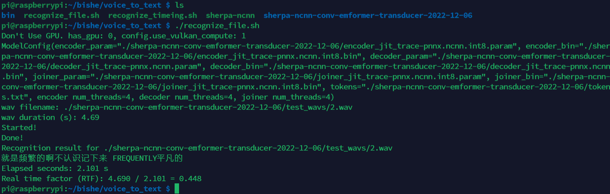
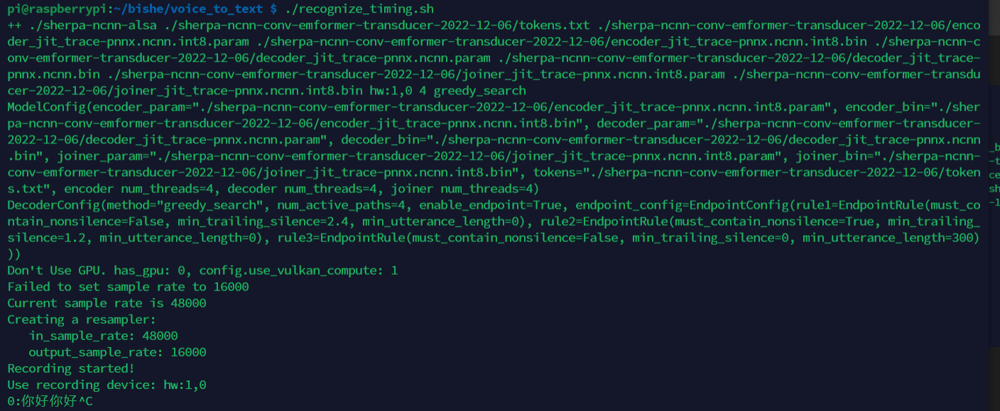

# voice_to_text_raspberry

```shell
链接：https://pan.baidu.com/s/1EUIGYBvBI2QzwexEmnjylw?pwd=lj9l
提取码：lj9l
```

单个文件识别：



实时语音识别：




注意：

* 将脚本设置为可执行权限    ``sudo chmod 777 recognize_file.sh``
* 将sherp_ncnn等设置权限 （执行脚本后再看需要设置那个）
